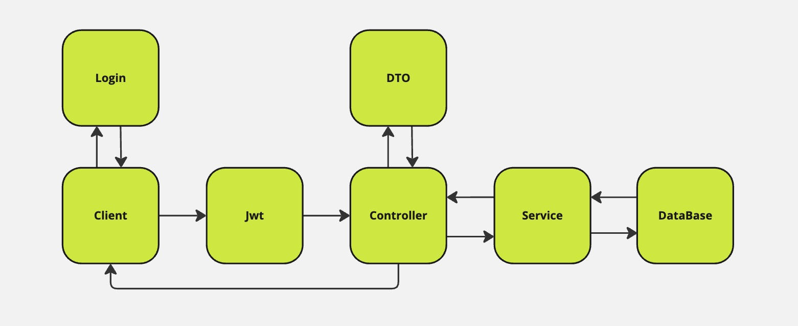

# School Blog Backend

Esta é uma aplicação desenvolvida como trabalho de pós-graduação na FIAP. O objetivo é criar o backend de um blog onde professores postam materiais para os alunos.

A aplicação utiliza **NestJS** com **Prisma** como ORM, conectando-se a um banco de dados **PostgreSQL**. Todos os endpoints são testados com **Jest**, e há ambientes configurados no **Postman** para testes locais e de produção.

## Índice

- [Tecnologias Utilizadas](#tecnologias-utilizadas)
- [Maneiras de Rodar o Projeto](#maneiras-de-rodar-o-projeto)
  - [Quick Run](#quick-run)
  - [Dev Run](#dev-run)
- [Arquitetura](#arquitetura)
  - [Fluxo Simplificado da API](#fluxo-simplificado-da-api)
  - [Estrutura de Diretórios](#estrutura-de-diretórios)
- [Testes](#testes)
- [Deploy](#deploy)
- [Desafios](#desafios)

## Tecnologias Utilizadas

- **NestJS**
- **Prisma ORM**
- **PostgreSQL**
- **Docker**
- **Jest**
- **GitHub Actions**
- **Render.com**

## Maneiras de Rodar o Projeto

### Quick Run

Para rodar localmente sem instalar dependências, utilize o Docker Compose:

```bash
 docker compose up
```

O aplicativo estará disponível em `http://localhost:3000/`. O arquivo `.env.docker` contém as variáveis de ambiente necessárias.

### Dev Run

Para rodar o app em ambiente de desenvolvimento, siga os passos:

1. Criar o banco de dados com Docker:

   ```bash
    sh create-local-db.sh
   ```

2. Instalar os pacotes Node.js:

   ```bash
    npm i
   ```

3. Rodar o app em modo de desenvolvimento:

   ```bash
    npm run dev
   ```

O aplicativo estará disponível em `http://localhost:3000/`. O arquivo `.env.local` contém as variáveis de ambiente para desenvolvimento.

## Arquitetura

Na arquitetura do projeto, são utilizados os conceitos de **Controllers**, **Providers** e **Modules** do NestJS.

- **Controllers**: Porta de entrada da aplicação, recebem requisições e enviam respostas.

  

- **Providers**: Fornecem serviços injetáveis e podem ser compartilhados entre diferentes partes da aplicação.

  

- **Modules**: Organizam controllers e providers, criando a estrutura modular do NestJS.

  

### Fluxo Simplificado da API

1. O cliente envia uma requisição `POST` para `/auth/login` com `username` e `password`.
2. Recebe um token JWT válido por 24 horas.
3. Com o token, o usuário pode acessar os endpoints protegidos.
4. A API valida o acesso baseado nos papéis: `ADMIN`, `TEACHER` e `STUDENT`.
5. DTOs validam os dados recebidos.
6. O service processa a lógica de negócio e acessa o banco de dados.



### Estrutura de Diretórios

- `./prisma` - Schemas de dados, migrações e seed.
- `./src` - Código fonte da aplicação NestJS.
  - `./src/user` - CRUD de usuários.
  - `./src/articles` - CRUD de artigos.
  - `./src/auth` - Fluxos de autenticação.
  - `./src/lib` - Utilitários compartilhados.
- `./create-local-db.sh` - Script para criar o banco local.
- `./docker-compose.yml` - Docker Compose para rodar a aplicação e o banco de dados.
- `./Dockerfile-git` - Dockerfile para CI/CD no GitHub Actions.

## Testes

Os testes utilizam o **Jest** e simulam chamadas aos endpoints da aplicação:

```bash
# Rodar todos os testes
 npm run test

# Rodar testes em modo de desenvolvimento
 npm run test:watch
```

Os arquivos `.spec.ts` contêm os testes de unidade e integração para os módulos.

## Deploy

A aplicação conta com um processo automatizado de deploy:

1. O banco de dados de produção está hospedado no **Render.com**.
2. As secrets de produção estão armazenadas no GitHub.
3. A GitHub Action cria uma imagem Docker de produção e a envia para o Docker Hub.
4. A **Render.com** lê a imagem `latest` e a disponibiliza na URL:

   ```bash
   https://school-blog-back-1727553447.onrender.com/
   ```

## Desafios

1. **Docker**: Primeiro projeto em que utilizei Docker extensivamente, aplicando-o em diversas situações, desde o banco local até o Dockerfile para CI/CD.
2. **Banco de Dados**: Primeira vez utilizando **PostgreSQL** e enfrentando desafios de deploy e modelagem com **Prisma**.
3. **Testes**: Utilizar o **Jest** foi um desafio inicial, mas a documentação do **NestJS** ajudou a integrar bem os testes à aplicação.
